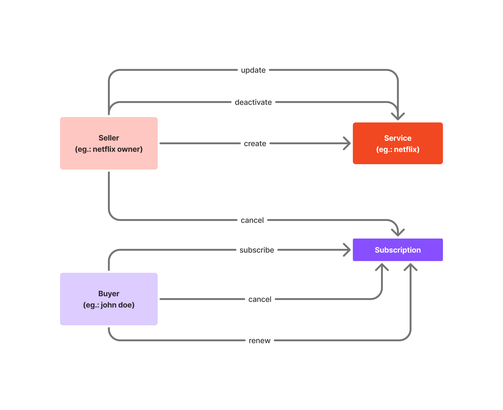
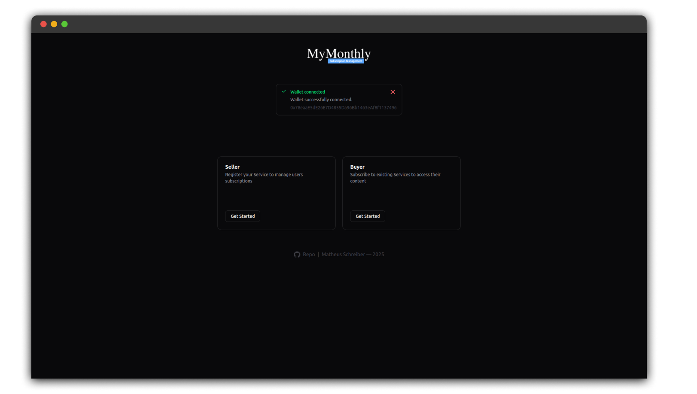

<p align="center">
    
    <br/><br/>
    <p align="center">
        Uma aplicação descentralizada para gerenciamento de serviços por assinatura como Netflix, Spotify e Disney+, utilizando contratos inteligentes para automatizar pagamentos, renovações e controle de acesso de forma segura e transparente.
    </p>
</p>

## Ideia

Factory de contratos para gerenciamento pagamentos e datas de expiração/vencimento de serviços por assinatura.



## Descrição

### Domínio e motivação

O domínio da aplicação é o setor de gerenciamento de serviços por assinatura. O problema abordado é a complexa rede de gerenciamento de pagamentos recorrentes e controle de acesso, que atualmente depende de intermediários centralizados e processos manuais. Alguns dos principais problemas desse procedimento incluem:

1. Contestações de Cobrança e Falta de Transparência
Os sistemas de pagamento tradicionais permitem que os usuários contestem cobranças, resultando em processos longos e custosos para as empresas. Com a blockchain, todas as transações são imutáveis e transparentes, fornecendo provas verificáveis de pagamento e reduzindo disputas.

2. Taxas Elevadas de Transação com Processadores Tradicionais
Empresas como Netflix e Spotify pagam altas taxas para processadores de pagamento como Visa e Mastercard. As transações em blockchain eliminam intermediários, reduzindo significativamente os custos e aumentando a lucratividade.

3. Complexidade e Custo de Pagamentos Internacionais
O processamento de pagamentos internacionais envolve conversões de moeda e tarifas bancárias, tornando o processo caro e complexo. As criptomoedas permitem pagamentos rápidos e sem fronteiras, com taxas mínimas, simplificando as assinaturas globais.

4. Privacidade e Segurança dos Dados Pessoais
Os pagamentos tradicionais exigem dados financeiros e pessoais sensíveis, aumentando o risco de fraudes e vazamentos de informações. Os pagamentos baseados em blockchain preservam a privacidade do usuário, eliminando a necessidade de fornecer informações pessoais e aumentando a segurança.

Com isso em mente, este projeto propõe uma solução descentralizada baseada em contratos inteligentes, automatizando pagamentos, renovações e revogações de acesso sem a necessidade de confiança em terceiros. Ao utilizar automações e pagamentos em criptomoedas, a plataforma garante transparência, segurança e eficiência para vendedores e assinantes.

### Capturas de tela





### Contract Factory

O conceito de Contract Factory será utilizado para permitir que cada vendedor crie e gerencie múltiplos contratos de assinatura de forma eficiente e descentralizada. A Factory atuará como um contrato mestre responsável por implantar novos contratos filhos sempre que um vendedor registrar um novo serviço (Netflix, OpenAI, SmartFit, Jornais por assinatura, planos de saúde, seguros de vida, seguros de automóveis, etc).

Cada contrato filho pertencerá a um desses vendedores (Netflix por exemplo), e então neste contrato haverá o controle dos assinantes, das datas de vencimento e dos estados atuais de cada assinatura.

### Eventos

O conceito de Events será utilizado para registrar e monitorar ações importantes dentro dos contratos inteligentes, permitindo que interfaces e serviços externos, reajam automaticamente às mudanças no estado da assinatura. 

Por exemplo, se houver o pagamento, deve-se renovar a data de expiração da assinatura e então atualizar no front-end da aplicação. O mesmo acontece caso a assinatura seja cancelada ou sua data de vencimento seja extrapolada.

## Configuração

Primeiramente, instale as dependências:
```
npm install
```

### Deploy local

Para realizar o deploy local do contrato, siga os passos:

**1. Altere o provider no `.env`**
```
VITE_LOCAL_PROVIDER_ENABLED='true'
```

**2. Limpe os artefatos do Hardhat e inicie o nó worker (mantenha-o em execução)**
```
npx hardhat clean && npx hardhat node
```

**3. Faça o deploy do contrato da fábrica localmente**
```
npx hardhat run --network localhost scripts/deploy.cjs
```
>Obs.: Salve o endereço do contrato

**4. Execute o servidor Vite**
```
npm run dev
```

**5. Conecte o contrato implantado**

Na página inicial (`http://localhost:5173/`) há um botão para isso

>Obs.: Para os ABIs, você pode inserir qualquer valor. Não importa no deploy local.

### Deploy com Metamask

Para o deploy real do contrato, siga:

**1. Altere o provider no `.env`**
```
VITE_LOCAL_PROVIDER_ENABLED='false'
```

**2. Faça o deploy do contrato da fábrica em qualquer plataforma**

Recomendação: [REMIX IDE](https://remix.ethereum.org/) 
>Obs.: Salve o endereço do contrato e os ABIs (Interface Binária de Aplicação) dos contratos ServiceFactory.sol e Service.sol

**3. Execute o servidor Vite**
```
npm run dev
```

**4. Conecte a carteira Metamask**

Na página inicial (`http://localhost:5173/`) há um botão para isso

**5. Use**

Aproveite o MyMonthly

## Testes

Para rodar os testes:

```
npx mocha 
```