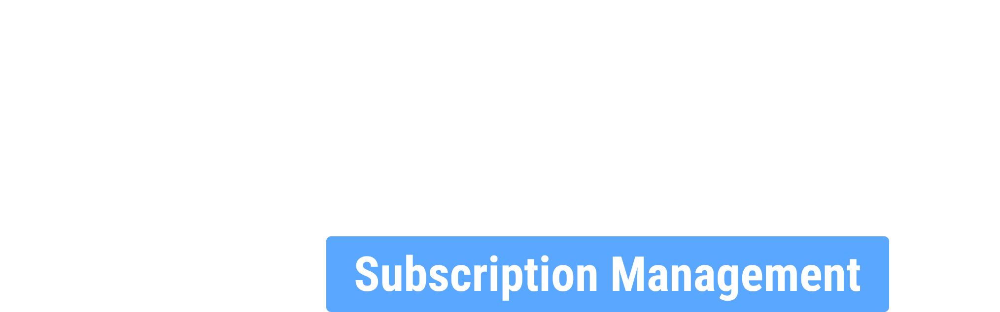
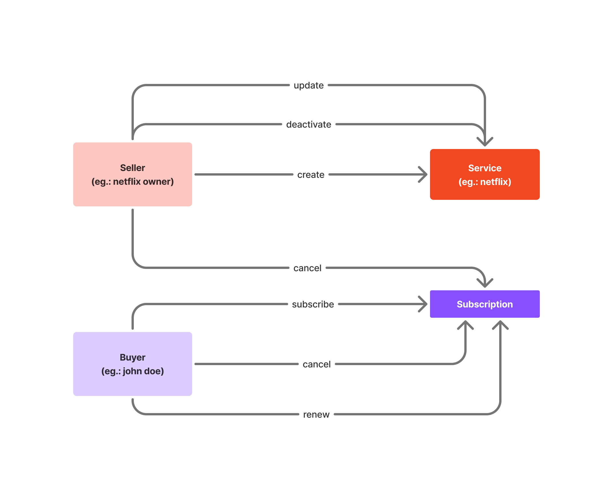

    
      
    

        A decentralized application for managing subscription services like Netflix, Spotify, and Disney+, leveraging smart contracts to automate payments, renewals, and access control securely and transparently.
    

[🇧🇷 Readme](README.br.md)

## Idea

A contract factory for managing payments and expiration dates of subscription services.

## Description

### Domain and Motivation

The application's domain is the subscription service management sector. The problem being addressed is the complex network of recurring payment management and access control, which currently relies on centralized intermediaries and manual processes. The DApp proposes a decentralized solution based on smart contracts, automating payments, renewals, and access revocations without the need for third-party trust. By utilizing Chainlink Automation, NFTs as credentials, and cryptocurrency payments, the platform ensures transparency, security, and efficiency for sellers and subscribers.

### Contract Factory

The concept of a Contract Factory will be used to allow each seller to create and manage multiple subscription contracts efficiently and in a decentralized manner. The Factory will act as a master contract responsible for deploying new child contracts whenever a seller registers a new service (e.g., Netflix, OpenAI, SmartFit, subscription-based newspapers, health plans, life insurance, car insurance, etc.).

Each child contract will belong to one of these sellers (e.g., Netflix), and within this contract, there will be control over subscribers, expiration dates, and the current states of each subscription.

### Events

The concept of Events will be used to log and monitor important actions within the smart contracts, enabling interfaces and external services to automatically react to changes in the subscription state.

For example, if a payment is made, the subscription's expiration date should be renewed and then updated on the application's front end. The same applies if the subscription is canceled or its expiration date is exceeded.

## Business Rules

### Seller

- [x] The seller must be able to create contracts for subscriptions made by customers for one of their services. Examples: Netflix, GYM, Health, Insurance, Newspaper, OpenAI, etc.

- [x] Each child contract is a service registered by a seller, containing the buyers who subscribed to that service.

- [x] The seller must be able to change the name and description of the service after its creation.

- [x] Service names must be unique (no duplicates).

### Buyer

- [x] The child contract must manage payments and expiration dates. This must be visible to the buyer (identified by their public key). The buyer must be able to:
    - [x] Subscribe to a new service
    - [x] Pay for an existing subscription
    - [x] Cancel a subscription
- [ ] (BONUS) Partial refund upon cancellation

- [x] Payments are made in cryptocurrencies (ETH).

- [x] If the buyer does not pay for the service by the expiration date, access to the service is revoked.
    - Events

- [ ] (BONUS) Mechanisms for periodic updates
    - [Chainlink Automations](https://chain.link/automation) or other automated services.
    - The buyer's permission update occurs when they access a page (e.g., a dashboard).

- [ ] Access to the service is only granted to the buyer upon payment of the contract. (Possibly use NFTs here as credentials - ERC721)?

- [ ] (BONUS) Allow refunds when a subscription is canceled or discounts for early payments.

### Global Visualization

- [ ] (BONUS) Use The Graph or blockchain APIs to visualize subscription contracts without centralization.